# Athena Keyboard

这是本站当前第一款支持小屏幕的键盘。这里简单说一下当前自定义小屏幕动图的方式。

当前使用的都是开放的工具网站和QMK的官方工具，后续会简化此步骤。


## 第一步，制作128x128的GIF图片

Athena使用的屏幕分辨率为128x128，因此，需要的图片分辨率也得是128x128。

有很多方法可以将GIF图片改到128x128尺寸，这里推荐使用一个叫ezgif的在线网站，下面步骤，只要操作一次就熟悉了。

### 1裁剪图片为正方形

如果图片已经是正方形的，可以跳过此步。

访问 https://ezgif.com/crop ，点击 `浏览` 选择一个本地图片，再点击 `Upload`，然后稍等片刻。

如下图，选择比例为1:1，再在上方预览部分，框选出需要截取用于显示的正方形区域，再点击Crop。

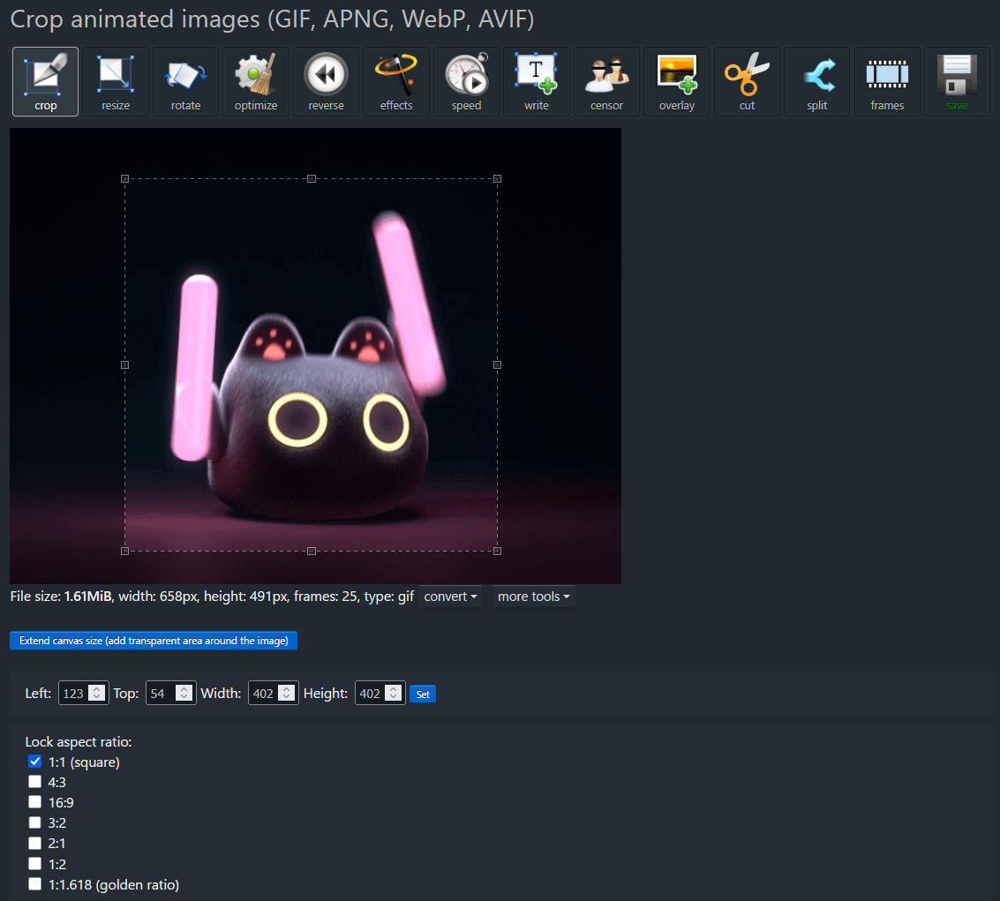

这样就得到了一个新的图，这已经是正方形了。

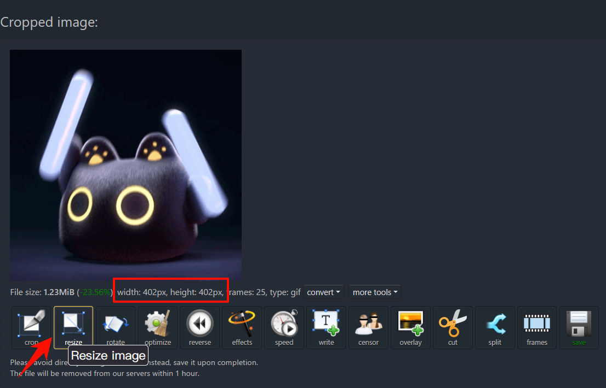

此时可以直接点击 Resize，进入第2步。


### 2 调整图片分辨率到128x128

已经是正方形的图片，只需要叫 width 或 height 设置为128，再点击 `Resize image`，就能得到128x128的图片了。

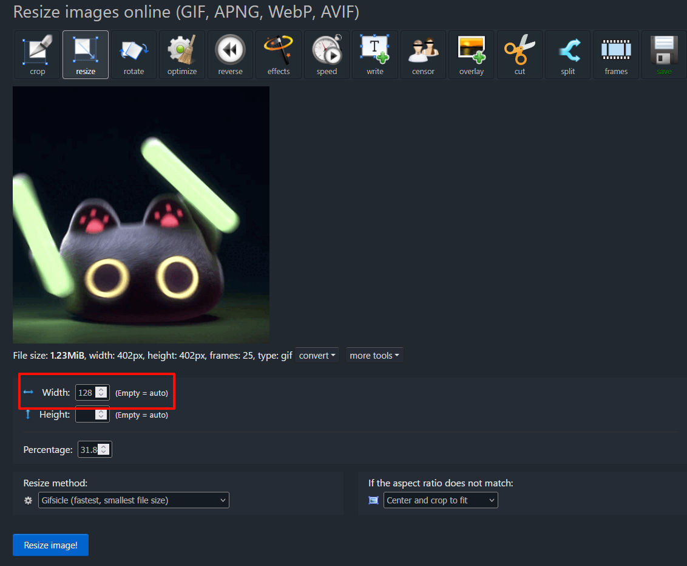

### 3 调整图片效果

如果是第一次修改这个图片，为了让它在Athena的小屏幕上显示效果更好，这里建议再通过 effects，对图片稍作调整。

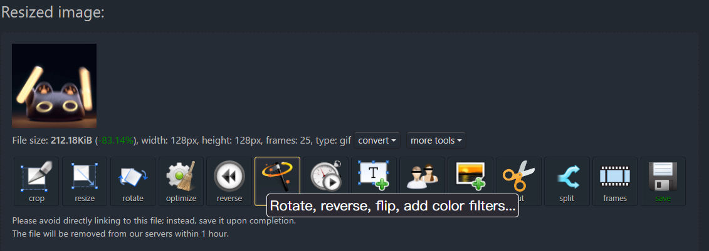

建议是将饱和度调到140%到150%。调整后记得点击一下下方的 `Apply selected` 按钮。

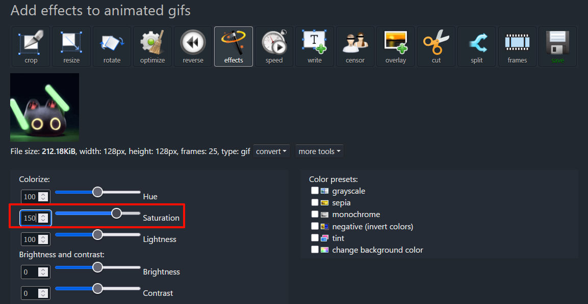

### 4 适当降低帧率

如果图片的帧率比较高，还需要降低一些，使用ezgif的这个工具，在第二步如果QGF使用默认RGB565，GIF请使用10到20fps，也就是每帧时间50到100ms。

转换后的文件尺寸，要不大于1M或2M，所以打字和CAPS的动画，最多约30帧，其他的固定循环动画最大使用60帧。

这里可以使用 optimize 中的 `Remove every 2nd frame`，这样减掉一半的帧。

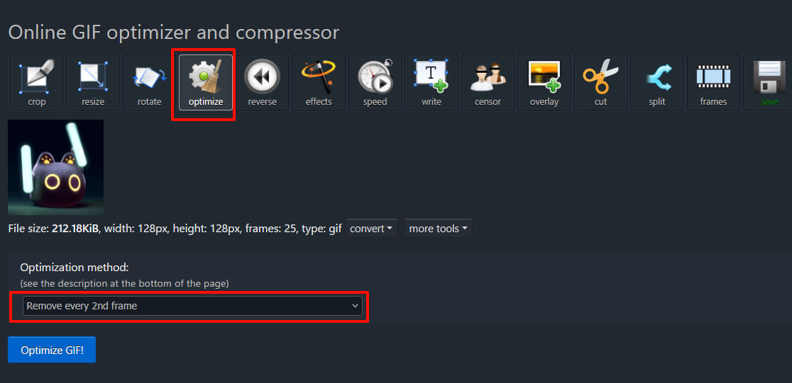

减掉后动画速度会变快，再用 speed 里，设置为 `50% of current speed`。

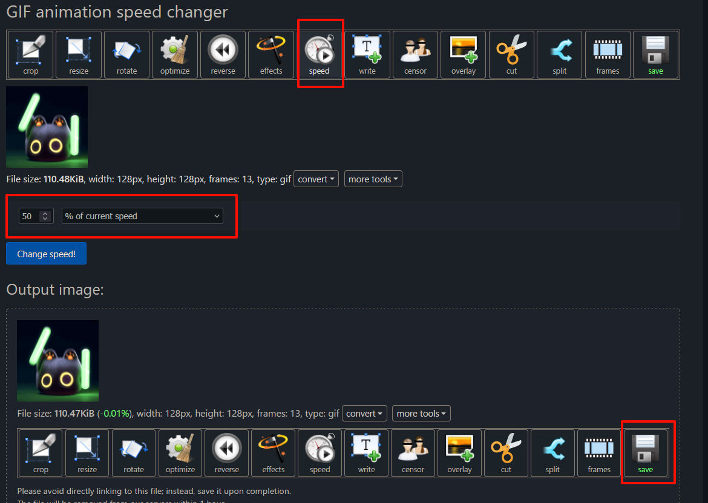

最后再点击 save，保存修改好的图片到本地。


## 第二步，转换GIF为QMK支持的QGF格式

QMK uses a graphics format _("Quantum Graphics Format" - QGF)_ specifically for resource-constrained systems.

qgf格式的说明见: [https://docs.qmk.fm/quantum_painter_qgf](https://docs.qmk.fm/quantum_painter_qgf)

目前只有QMK的官方工具可以转换这个格式。

### 1 安装QMK环境

如果没有安装过编译环境，先参考这里: https://docs.qmk.fm/newbs_getting_started 。

如果只需要转换格式或简单开发，在windows下更推荐安装 QMK MSYS。

具体操作一共只有两步:
1. 安装`QMK_MSYS.exe`
2. 在安装后的环境里，运行命令 `qmk setup`。

具体如下:

从 https://github.com/qmk/qmk_distro_msys/releases/latest 下载最新的 `QMK_MSYS.exe`，然后双击运行安装它，安装时的所有选项保持默认即可。

安装后默认路径是 `C:\QMK_MSYS`。如下图，运行此文件夹下的 `QMK_MSYS`，显示信息如下。

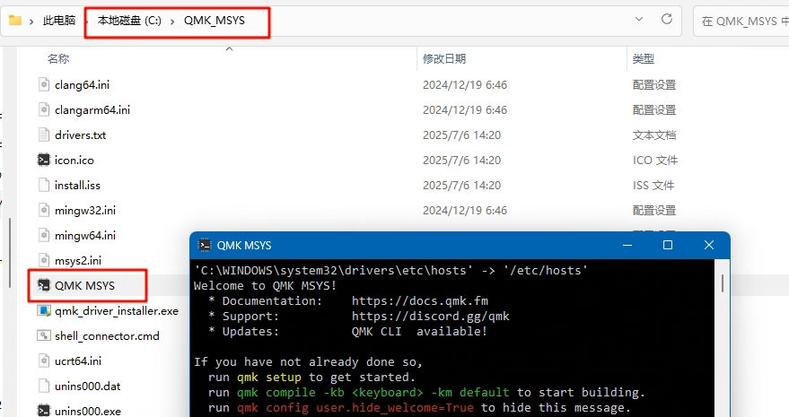

再输入命令 `qmk setup`，然后输入 y 确认一次，就耐心等待安装完成。

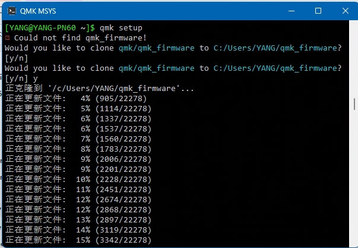

安装完成后，如下图，会显示 `QMK is ready to go`

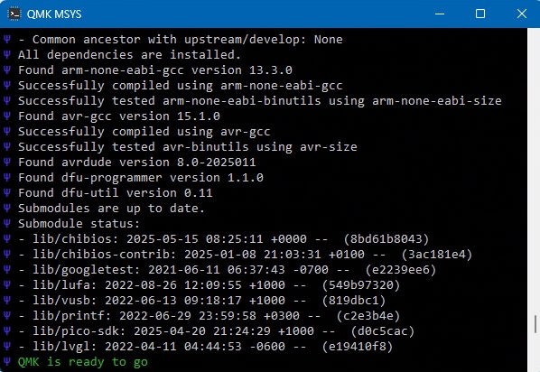

这样QMK的运行环境就已经安装好，此操作只需要执行一次。

### 2 转换图片

这时需要使用到命令行，qmk的官方文档对应位置见下面链接:

https://docs.qmk.fm/quantum_painter#quantum-painter-cli

假如在第一步里，保存的文件为 `athena1.gif`，然后把它放在了 `C:\gif` 这个目录里。

我们需要做的就是在 QMK_MSYS 里，先用 `cd C:\gif` 转到该目录下，再执行如下命令。

```
qmk painter-convert-graphics -f rgb565 -i athena1.gif -w -o ./
```

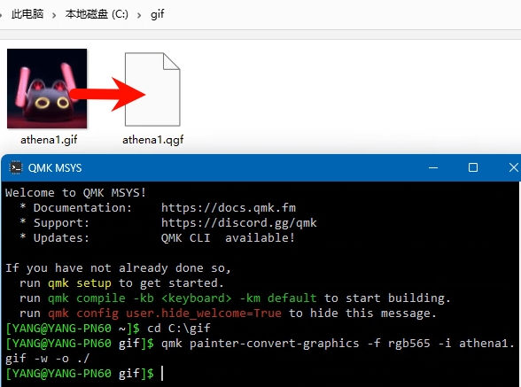

如上图，如果没有报错，就得到了 athena1.qgf。


## 第三步，将QGF写入到键盘内

Athena一共存放了6个图片，它们的qgf文件的大小有如下限制。

|保存地址??30%|内容|大小限制|
|---|---|---|
|0x10400000|GIF0_大小写|1MByte|
|0x10500000|GIF1_动态打字|1MByte|
|0x10600000|GIF2|2MByte|
|0x10800000|GIF3|2MByte|
|0x10A00000|GIF4|2MByte|
|0x10C00000|GIF5|2MByte|

目前采用的方法是将qgf文件转为RP2040支持烧录的uf2格式，然后再在Bootloader下烧录对应的gif文件，以此来替代键盘固件内的gif动画。

这里用一个网页小工具来转换。

https://openkbd.github.io/tools/athena/

