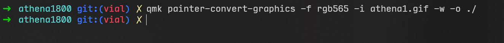

# Athena Keyboard

这是本站当前第一款支持小屏幕的键盘。这里简单说一下当前自定义小屏幕动图的方式。

当前使用的都是开放的工具网站和QMK的官方工具，后续会简化此步骤。


## 第一步，制作128x128的GIF图片

Athena使用的屏幕分辨率为128x128，因此，需要的图片分辨率也得是128x128。

有很多方法可以将GIF图片改到128x128尺寸，这里推荐使用一个叫ezgif的在线网站，下面步骤，只要操作一次就熟悉了。

### 1裁剪图片为正方形

如果图片已经是正方形的，可以跳过此步。

访问 https://ezgif.com/crop ，点击 `浏览` 选择一个本地图片，再点击 `Upload`，然后稍等片刻。

如下图，选择比例为1:1，再在上方预览部分，框选出需要截取用于显示的正方形区域，再点击Crop。


这样就得到了一个新的图，这已经是正方形了。


此时可以直接点击 Resize，进入第2步。


### 2 调整图片分辨率到128x128

已经是正方形的图片，只需要叫 width 或 height 设置为128，再点击 `Resize image`，就能得到128x128的图片了。


### 3 调整图片效果

如果是第一次修改这个图片，为了让它在Athena的小屏幕上显示效果更好，这里建议再通过 effects，对图片稍作调整。


建议是将饱和度调到140%到150%。调整后记得点击一下下方的 `Apply selected` 按钮。


### 4 适当降低帧率

如果图片的帧率比较高，还需要降低一些，使用ezgif的这个工具，降低到10到15fps比较合适。目前单核运行的固件，太高的gif帧率会影响键盘按键的稳定性。

这里可以使用 optimize 中的 `Remove every 2nd frame`，这样减掉一半的帧。


减掉后动画速度会变快，再用 speed 里，设置为 `50% of current speed`。


最后再点击 save，保存修改好的图片到本地。

> [!yddh] 补充
> - 目前Athena180上使用的RP2040，如果两个核心都使用，还有点bug。等双核支持完善后，就可以支持更高的帧率。

## 第二步，转换GIF为QMK支持的QGF格式

QMK uses a graphics format _("Quantum Graphics Format" - QGF)_ specifically for resource-constrained systems.

qgf格式的说明见: [https://docs.qmk.fm/quantum_painter_qgf](https://docs.qmk.fm/quantum_painter_qgf)

目前使用QMK的官方工具转换，首先需要有安装QMK的编译环境，如果已装可以跳过。

### 1 安装QMK编译环境

如果没有安装过编译环境，先参考这里，我自己使用的是WSL Ubuntu。

QMK的教程在如下链接，要运行 qmk setup 无报错后，运行环境就可用了。

https://docs.qmk.fm/newbs_getting_started

### 2 转换图片

这时需要使用到命令行，qmk的官方文档对应位置见下面链接:

https://docs.qmk.fm/quantum_painter#quantum-painter-cli

假如在第一步里，保存的文件为 athena1.gif，建议将这个文件放到qmk的子目录下，比如我是放在athena1800所在的目录。然后在此目录下，执行如下命令

```
qmk painter-convert-graphics -f rgb565 -i athena1.gif -w -o ./
```



如上图，如果没有报错，就得到了 athena1.qgf。

## 第三步，将QGF写入到键盘内

Athena一共存放了6个图片，它们的qgf文件的大小有如下限制。

|保存地址??30%|内容|大小限制|
|---|---|---|
|0x10400000|GIF0_大小写|1MByte|
|0x10500000|GIF1_动态打字|1MByte|
|0x10600000|GIF2|2MByte|
|0x10800000|GIF3|2MByte|
|0x10A00000|GIF4|2MByte|
|0x10C00000|GIF5|2MByte|

目前采用的方法是将qgf文件转为RP2040支持烧录的uf2格式，然后再在Bootloader下烧录对应的gif文件，以此来替代键盘固件内的gif动画。

这里用一个网页小工具来转换。

https://openkbd.github.io/tools/athena/

