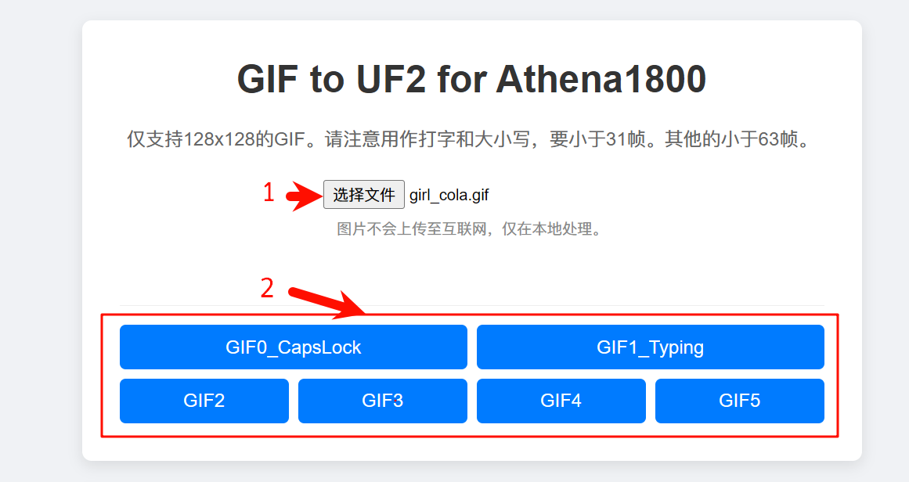

# Athena Keyboard

这是本站当前第一款支持小屏幕的键盘。这里简单说一下当前自定义小屏幕动图的方式。

支持的图片尺寸是128x128的。可以使用现有的符合条件的GIF图。

## 转换GIF为UF2格式，刷入键盘

这里给了一个简单的在线工具，https://openkbd.github.io/tools/athena/

选择上传符合条件的GIF文件。条件是:
1. GIF图片的分辨率是128x128
2. 用作GIF0和GIF1的，要小于31帧。用作GIF2到GIF5的，要小于63帧。

再下载对应的GIFx，下载的结果文件格式为UF2。键盘进入刷机模式后，将这个UF2文件像烧录固件一样，拖到目标磁盘内，完成更新对应的GIFx。

> [!yddh] 提醒
> - 如果一定使用大于63帧的图，可以让它占用多个动图存储来实现。
> - 例如保存到GIF2，限制是63帧，但如果写入超过63帧小于126帧的图，则占用GIF3的位置。此时虽然GIF3无法正常读取，但GIF2是可以正常显示的。
> - 但注意，这时不要再写入新的GIF3，一旦写入，它破坏了GIF2的结构，会导致GIF2不可用了。 
> - 用这个方法，在GIF2的位置，最大可以写入63\*4 = 252帧的动图(即同时占用GIF2 3 4 5的存储)。

## 自己修改制作128x128的GIF图片

如果你要使用的GIF图不是128x128的，则需要先做一些加工。

有很多方法可以将GIF图片改到128x128尺寸，这里推荐使用一个叫ezgif的在线网站，下面是步骤，只要操作一次就熟悉了。

### 1裁剪图片为正方形

如果图片已经是正方形的，可以跳过此步。

访问 https://ezgif.com/crop ，点击 `浏览` 选择一个本地图片，再点击 `Upload`，然后稍等片刻。

如下图，选择比例为1:1，再在上方预览部分，框选出需要截取用于显示的正方形区域，再点击Crop。

这样就得到了一个新的图，这已经是正方形了。

此时可以直接点击 Resize，进入第2步。

### 2 调整图片分辨率到128x128

已经是正方形的图片，只需要叫 width 或 height 设置为128，再点击 `Resize image`，就能得到128x128的图片了。

### 3 调整图片效果

如果是第一次修改这个图片，为了让它在Athena的小屏幕上显示效果更好，这里建议再通过 effects，对图片稍作调整。

建议是将饱和度调到140%到150%。调整后记得点击一下下方的 `Apply selected` 按钮。

### 4 适当降低帧率

如果图片的帧率比较高，还需要降低一些，使用ezgif的这个工具，在第二步如果QGF使用默认RGB565，GIF请使用10到20fps，也就是每帧时间50到100ms。

转换后的文件尺寸，要不大于1M或2M，所以打字和CAPS的动画，最多约31帧，其他的固定循环动画最大使用63帧。

这里可以使用 optimize 中的 `Remove every 2nd frame`，这样减掉一半的帧。

减掉后动画速度会变快，再用 speed 里，设置为 `50% of current speed`。

最后再点击 save，保存修改好的图片到本地。

## 额外补充说明

除了使用本站提供的工具转换gif外，也可以使用qmk的官方命令行，先将gif转为qgf格式，再把qgf转为uf2格式。这部分因为要安装qmk的运行环境，所以会复杂一些，可以参考qmk的官方文档。

Athena一共存放了6个图片，它们的qgf文件的大小有如下限制。

|保存地址??30%|内容|大小限制|
|---|---|---|
|0x10400000|GIF0_大小写|1MByte|
|0x10500000|GIF1_动态打字|1MByte|
|0x10600000|GIF2|2MByte|
|0x10800000|GIF3|2MByte|
|0x10A00000|GIF4|2MByte|
|0x10C00000|GIF5|2MByte|
