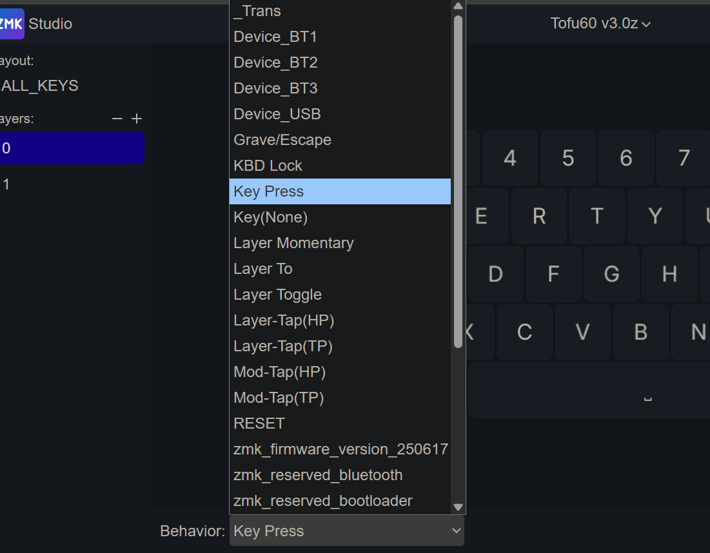

# ZMK

ZMK的官方说明网站: https://zmk.dev/docs

本站所使用的固件，修改按键使用的 zmk 官方的 https://zmk.studio 。

在ZMK的基础上有一定的修改，对部分功能按键进行了改进，以及为了方便排序，对部分功能进行了重命名。当前支持的主要功能如下图所示:



我将列表里支持的功能，再分类一下，如下图。这样方便后文单独说明。

```mindmap
ZMK
  设备切换
    Device_USB
    Device_BT1
    Device_BT2
    Device_BT3
  Key Press
    常规104键盘上能见到的按键
    多媒体键和系统键
    修饰键加按键的组合如Win+Shift+S
    仅多个修饰键同时如Hyper(Ctrl+Shift+Cmd+Opt)
    鼠标模拟键
  层切换
    Layer Momentary
    Layer To
    Layer Toggle
  TAP-KEY
    Layer-Tap(HP) & Layer-Tap(TP) 
    Mod-Tap(HP) & Mod-Tap(TP)
  Other
    _Trans & Key(None)
    KBD_Lock
    RESET
```