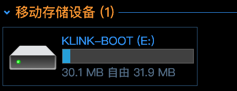

# Bootloader，刷固件

这里介绍如何不同的Bootloader刷固件的不同方法，同样类型的Bootloader刷固件方式大致是相同的。

目前本站zmk的键盘，使用的Bootloader都是基于 https://github.com/adafruit/Adafruit_nRF52_Bootloader/ 的。

## 刷新固件
进入刷机模式的方式有多种。

- 键盘上设置按键 RESET，然后长按这个键，进入刷机模式。
- 在电池开关关闭状态，按住Esc不放，插入数据线。

刷机模式下，指示灯会显示绿色呼吸灯模式，电脑上会显示一个名称为KLINK-BOOT的磁盘。如果一段时间无操作，键盘会自动退出刷机模式。

要刷新固件，只需要将新固件的 UF2 文件拖到这个磁盘里。

UF2文件复制或拖到磁盘后，刷新完会自动退出。有的系统里因为不是手动安全弹出磁盘，可能会报错，这是正常现象。更详细说明可以参看: https://zmk.dev/docs/troubleshooting/flashing-issues

## File Transfer Error

https://zmk.dev/docs/troubleshooting/flashing-issues

Variations of the warnings shown below occur when flashing the `<firmware>.uf2` onto the microcontroller. This is because the microcontroller resets itself before the OS receives confirmation that the file transfer is complete. Errors like this are normal and can generally be ignored. Verification of a functional board can be done by attempting to pair your newly flashed keyboard to your computer via Bluetooth or plugging in a USB cable if `ZMK_USB` is enabled in your Kconfig.defconfig.

||
|---|
|An example of the file transfer error on Windows 10|

||
|---|
|An example of the file transfer error on Linux|

||
|---|
|An example of the file transfer error on macOS|