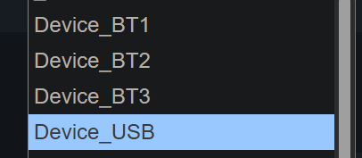

# 蓝牙连接和设备切换

ZMK原本的蓝牙切换方式，是将USB或蓝牙输出，以及蓝牙设备之间切换分开的。本站提供的固件对这部分进行了简化。设备切换一共要用到的是4个功能按键。

这4个键一般设置在<key>Fn+u i o p</key>键位上，如果是40%或更小的则是 <key>Fn+H J K L</key>。功能说明如下表:

| 功能与默认快捷键??30% | 短按功能 | 长按(3s以上)功能 |
|:--- |:--- | :--- |
| <u>Device_USB</u> <key>Fn+u</key> | 切换到USB输出 | 无作用 |
| <u>Device_BT1</u> <key>Fn+i</key> | 切换到蓝牙设备1 | 重置蓝牙通道1为配对模式 |
| <u>Device_BT2</u> <key>Fn+o</key> | 切换到蓝牙设备2 | 重置蓝牙通道2为配对模式 |
| <u>Device_BT3</u> <key>Fn+p</key> | 切换到蓝牙设备3 | 重置蓝牙通道3为配对模式 |

> [!yddh] 提醒
> - 这里的Fn，在不同的键位上默认位置和功能不一定相同，它是特定层的切换键。
> - 使用<key>Fn+u i o p</key>也是因为不容易被误按到。其中i和o都是指字母i和o，而不是数字1和0。
> - 可以按自己的习惯，将上面4个键设置到别的位置。

## 配对蓝牙设备

如果要将蓝牙配对到蓝牙设备1，务必先长按 <u>Device_BT1</u> <key>Fn+i</key> 3秒以上，此时指示灯会闪烁且指示为配对模式。然后，在要新配对的设备上，搜索到键盘的蓝牙名称，连接上即可。

同理，要配对蓝牙设备2或3，就先长按 <u>Device_BT2</u> 或 <u>Device_BT3</u>。

在正常连接使用或切换过程中，注意不要再长按。一旦长按将该蓝牙通道重置为配对模式，会清除当前通道与对应设备的配对信息，就无法正常连接了。

> [!ydda] 注意: 
> - 如果清除了键盘端蓝牙设备X的配对信息，务必也记得删除掉对应设备上的配对连接。
> - 如果只是清除了但未删除对应设备的连接，该设备会一直尝试连接键盘。如果需要重新配对，也是需要先删除再重新搜索并连接。

## 切换设备

在键盘使用过程中，可以随时在USB和3个不同的蓝牙设备间进行切换。只需要按对应的 <u>Device_XXX</u> 键即可。

## 蓝牙指示灯

键盘上自带了一个RGB指示灯，除了一般作为大小写指示灯功能外，它也可以指示蓝牙连接状态。

| 指示的设备 | 配对模式 (连接未配对设备) | 蓝牙连接中 (连接已配对设备) | 蓝牙连接成功 (连接已配对设备) |
|:--- |:--- |:--- |:--- |
| 蓝牙设备1 | 黄色与红色交替快闪 | 黄色与蓝色交替快闪 | 黄色慢闪3次 |
| 蓝牙设备2 | 青色与红色交替快闪 | 青色与蓝色交替快闪 | 青色慢闪3次 |
| 蓝牙设备3 | 紫色与红色交替快闪 | 紫色与蓝色交替快闪 | 紫色慢闪3次 |

在键盘重新通电时，或者每次手动切换设备或清除配对时，都会触发蓝牙连接状态指示灯。

暂时没有设定切换到USB时的指示灯。