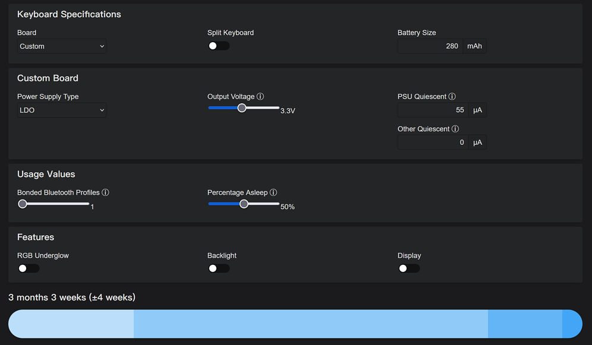

# 键盘节能

## 自动节能
 
 ZMK本身就非常节能，一般情况下就正常使用键盘即可，不用特意去手动节能。

本站的固件，有增加一个键盘上自带的一个CapsLock指示灯，这个指示灯默认点亮时会消耗1ma左右的电流。因此在不使用电脑时，尽量保持CapsLock关闭，不要让该指示灯处于常亮状态。

## 手动节能

支持的功能列表里，有一个 <u>KBD Lock</u>

需要自行设置到键盘的某个按键上。长按它(为防止误按)3秒以上，键盘进入锁定状态，这时蓝牙断开。

要从锁定状态退出，按 <key>F</key>键。

> [!yddh] 提醒
> - 该功能后续可能会有变动，将改为同时按住多个键才能退出锁定状态。

## 续航预期

zmk提供了一个简单的工具，用于计算续航。地址是 https://zmk.dev/power-profiler 。

如上图这样选择，主要是 Custom 和 LDO。显示结果可供参考。