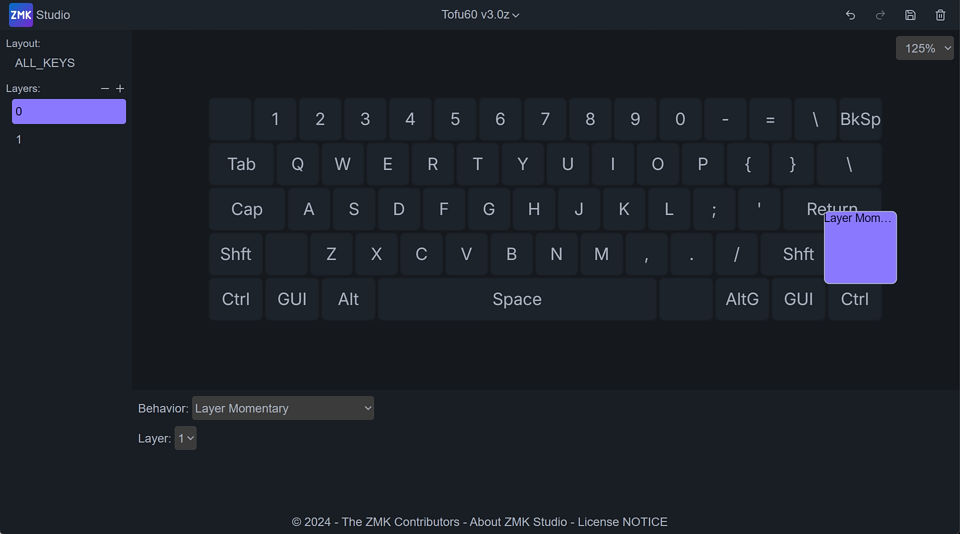
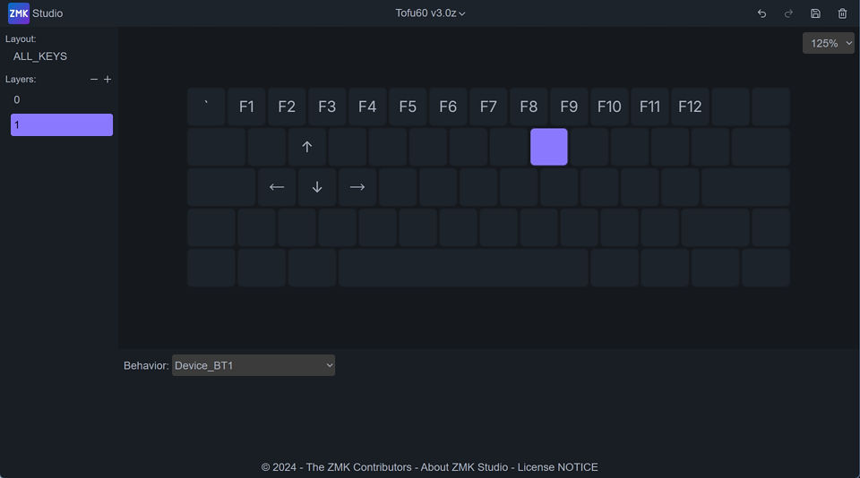

# 瞬时开启层

类似于量产键盘的FN，属于最常用也是入门必学会的功能之一。一般人理解的Fn+1输出F1，最基础就是用这个来实现。

ZMK 里这种层切换方式叫 Layer Momentary。

简单以60来举例说，在Layer 0，选择一个键，选择 <u>Behavior</u> 为 <u>Layer Momentary</u>，选择 Layer 为 1。

然后切换到Layer 1，再对Layer 1的按键进行设置。

像如上图设置之后，按住 RShift 右边这个  <u>Layer Momentary 1</u>，再按最上面一行1到0键，对应触发的就是F1到F10了。