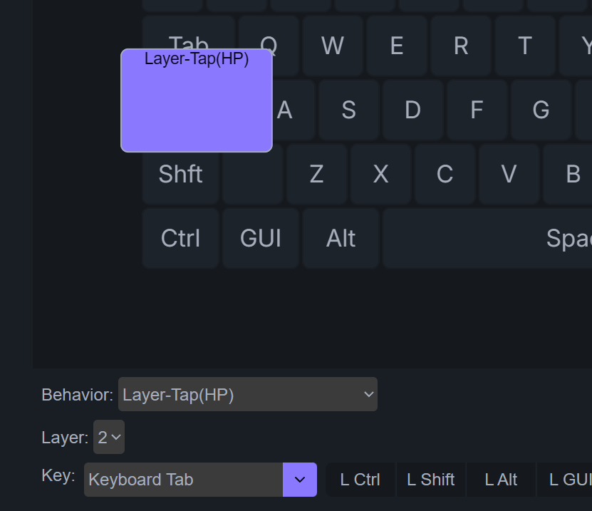
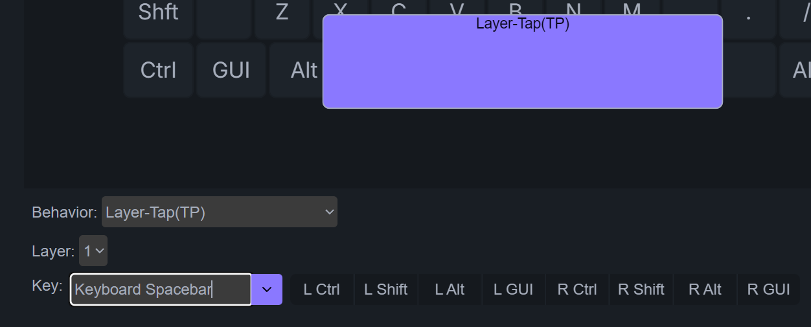

# 按键 | 瞬时开启层

zmk的相关说明可以参考。https://zmk.dev/docs/keymaps/behaviors/hold-tap#layer-tap

本站的固件，将Layer-Tap分成了两种可以直接从 ZMK Studio 里设置。
1. Layer-Tap(HP)，是指 Layer-Tap (Hold-Preferred)
2. Layer-Tap(TP)，是指 Layer-Tap (Tap-Preferred)

## Layer-Tap(HP)

举一个例子，设置一个原来层0的CapsLock位置的按键为点击时是 <kbd>Tab</kbd>，长按时则为瞬时开启层2。

这里使用的是 Layer-Tap(HP)，是因为这个按键在这里的设置习惯上，更多的时候是趋向于与其他按键组合使用，所以使用 Hold-Preferred，这样也更快的触发组合键。

## Layer-Tap(TP)

再举一个例子，设置空格键为点击时是<kbd>Space</kbd>，长按时是瞬时开启层1。

在这里就更适合使用 Tap-Preferred，因为空格很多时候都是作为单击使用，特别是它和其他按键这间，单击的时间间隔很短，短到时可能存在空格键和其他键是处于同时按下的。此时若使用 Hold-Preferred，就会触发瞬时开启层1后的按键。

## 长按按键

这两种 Layer-Tap，长按的时候，都是触发的瞬时开启层。

但是有时除了单击某个按键外，也会用到长按按键。比如上面的设置，有时仍然会需要长按空格键。

操作方法是双击再按住不放，这时触发的是长按按键，就不会瞬时开启层了。