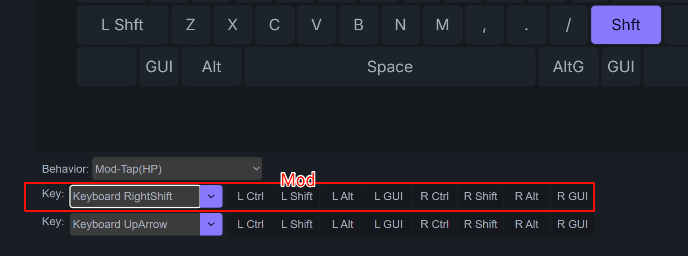

# 按键 | 修饰键

明白了前面的 `按键 | 瞬时开启层` 后，这个 `按键 | 修饰键` 的功能就非常好理解了。  

zmk的相关说明可以参考: https://zmk.dev/docs/keymaps/behaviors/hold-tap#mod-tap

本站的固件，将Mod-Tap分成了两种可以直接从 ZMK Studio 里设置。

1. Mod-Tap(HP)，是指 Mod-Tap (Hold-Preferred)
2. Mod-Tap(TP)，是指 Mod-Tap (Tap-Preferred)

## Mod-Tap(HP)

在 <u>Behavior</u> 里选择 <u>Mod-Tap(HP)</u>。

设置按键里，第一行是设置修改键Mod，可以是单个或多个修饰键。第二行是设置点击(Tap)时，触发的按键。可以是修饰键组合键。

## Mod-Tap(TP)

有些时候，可能需要设置Tap-Preferred，才好用。 HP和TP的区别，与 Layer-Tap 是一样的。

## 长按按键

这两种 Mod-Tap，长按的时候，都是触发长按修改键。

但是有时除了单击某个按键外，也会用到长按按键。

操作方法是双击再按住不放，这时触发的是长按按键。