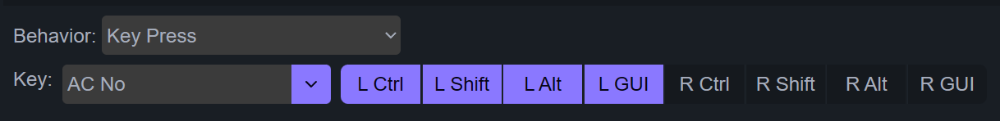

# 修饰键(组合键)
## 功能描述
修饰键，指ctrl shift alt(option) win(command)这些。此功能可以设置按键为
1. <kbd>Ctrl+Shift</kbd> 这样的多个修饰键一起按下。
2. <kbd>Win+E</kbd>，<kbd>Ctrl+Shift+S</kbd>这样的组合键。

## 设置方法

和设置常规按键的方法相似， <u>Behavior</u> 选择 <u>Key Press</u>，然后再选择一个按键。

选择按键后，在按键旁边，选中一个或多个修饰键。如下图，就是将选中按键设置为 <kbd>Ctrl+Shift+A</kbd>

如果只是想设置多个修饰键的组合，只需要将 Key 设置为其中一个修饰键就行。如下图，按下就是 <kbd>Ctrl+Shift+Alt+GUI</kbd>

> [!yddh] 提醒
> - 必须在key里选择一个后，才能选择修饰键组合。
> - 如果只是想设置多个修饰键组合，除了上面说的方法外，还可以将 Key 设置为一个当前系统下不支持的按键。比如 <u>AC NO</u>。

