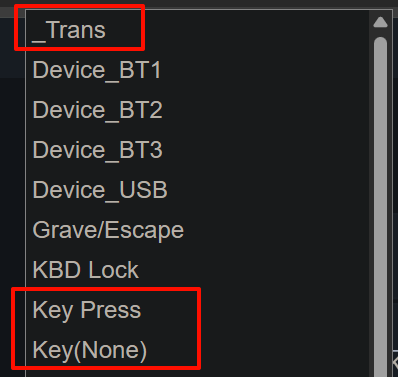
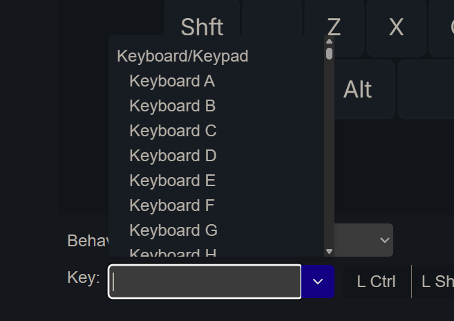

# 常规按键

常规按键指，按下代表一个键的按键。

这里面还有有两个特殊的。
  - <u>_Trans</u>，这个按键将穿透到更低的层。
  - <u>Key(None)</u>，在当前层禁用此按键。

上面两个特殊的按键直接在列表里选择即可。

其他的按键，在选择 <u>Key Press</u> 后，下面会再出现一个 Key 的可选列表，从列表里选择按键。

这个 Key 列表里列出了所有 USB HID 支持的按键，但并不是所有的按键在系统上都是可用的，如果要具体了解，可以查看: https://zmk.dev/docs/keymaps/list-of-keycodes

这些按键，都是用名称命名的，有一些符号按键的名称可能并不熟悉。

可以使用下面这个链接里辅助设置，点击按键会复制对应的按键名称，再在 Key 的设置里直接粘贴，就能筛选出对应的按键。

<待补充链接>