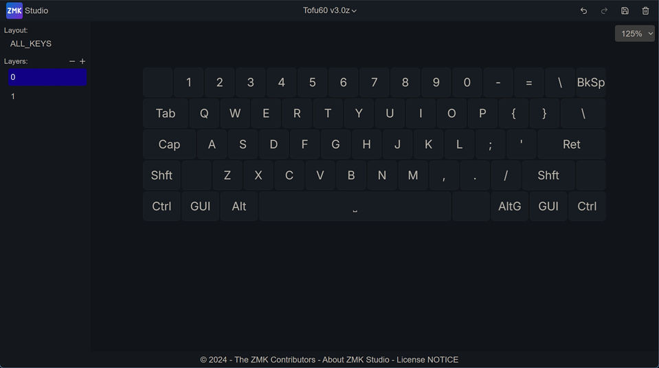

# 修改按键

本站所使用的固件，修改按键使用的 zmk 官方的 [https://zmk.studio](https://zmk.studio/) 。

目前ZMK Studio足以满足基本的按键设定，只是相对于VIA，操作起来不是那么方便，但相信随着不断改进，使用体验也会变得越来越好的。

## 连接键盘

在Windows或macOS上要修改按键，先将键盘与电脑通过USB有线连接好。然后，使用Chrome或Edge浏览器打开网址 https://zmk.studio 。

点击USB，再选择键盘。这里要选择的一般就是 <u>键盘的USB设备名(COMxx)</u>。

连接成功后，页面上就会显示出当前键盘的按键配置。

## 修改按键功能

修改按键整体分为3步:
1. 选择按键
2. 设置按键功能
3. 保存

### 1 选择按键
先选中一个按键，这时下方也会展示这个按键当前对应的功能。

### 2 设置按键功能
再选择好Behavior后，选择按键(Key)，这里可以手动输入文字过滤一下。下图中的例子，就是将选中的按键设置为BackSpace。

> [!ydda] 注意
> - ZMK的列表内的部分按键的命名，可能与习惯不同。比如上面Delete是macOS的按键名，这个键在Windows下就是BackSpace，但是这个列表里直接输入BackSpace是找不到正确结果的。
> - 这里只是先提醒一下这一点，后面详细的按键功能说明里，会给出按键名称的对应关系。

### 3 保存
上述操作后，再按键盘上这个位置的按键，可以看到它的功能已经变为BackSpace了。但是，这只是临时生效。在测试一个或多个按键设置无问题之后，还需要点击右上角的保存按钮，按键设置才会最终保存到键盘存储里。

## 一点补充

ZMK Studio目前无法显示所有的功能，可以看到部分按键上是空白的，如下图。这些按键需要选中后，才知道它的设置。这也是目前使用上略显不便的一点。

这里有一个小的油猴脚本改进了一点显示，将每个按键的 Behavior 都显示了出来。

<待添加链接>